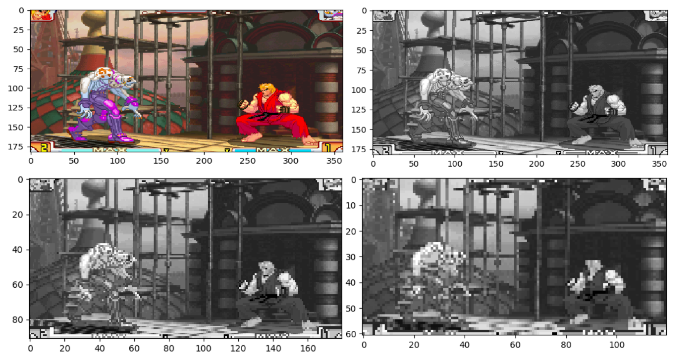
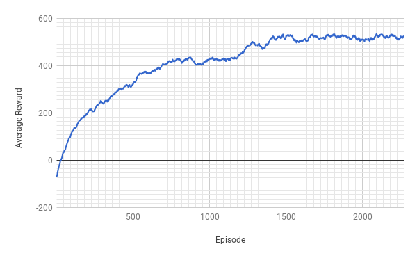

# Playing Street Fighter with Deep Reinforcement Learning

For my final year project as Aston university I developed the MAMEToolkit library to train reinforcement learning algorithms against arcade games.
Along with the library I created some ConvNet agents trained using Policy Gradient to Street Fighter. The repository contains the implementations of these agents.

## PyTorch Dissertation Implementation
This project demonstrates how a ConvNet can be used with Policy Gradients to play Street Fighter. 
Although we could see performance improvement, not enough time was spent on training the agent with different hyper-parameters. 
Given more time, it would have been interesting to explore how adjusting the amount of neurons and the amount of layers would affect the agent’s performance.

It was interesting to observe how the agents learnt to play in story mode against an array of characters, 
especially seeing how their behaviour evolved over time relative to the games mechanics. 
In Street Fighter, there is the “blocking” mechanic, which allows a player to avoid taking damage if used correctly. 
There are two types of blocking which the agent had to be able to play against. 
To give a simplified description, when the opponent is blocking low, then you must attack from above, and when the opponent is blocking high, then you must attack below.
The agent was not only able to learn how to attack past its opponent’s blocks, but it was also able to partially learn to block against its opponent. 
The agent would choose attacks which suited the situation, even including a special attack, 
however, most of the time it stuck to 3 main attacks for when the opponent was low, high, or in the air. 

The special attack it learnt took 3 time steps to complete and seemed to be triggered when the opponent was right above the agent. 
Although this may seem like a small achievement, it meant that the previous assumption, 
that the agent would be able to complete combos by discerning which actions had previously been pressed using only observations was correct. 
Being able to choose actions for the situation meant that the agent was able to recognise its opponent, regardless of the character. 
It was hoped the agent would have performed more combos, which upon further consideration could have been achieved using a technique involving prior knowledge. 
By predefining all of the action steps required for the agent to perform a combo, the agent could have occasionally ignored the networks outputs and instead fed in the combo steps, 
then when the network is trained the agent would pretend the actions were generated by the network. 
This would mean that when the combo was successful, then the agent would have an increased probability of using that combo in the future, 
although this may be undermined by policy gradients being an on-policy algorithm.
There was also the concern that when frames were being pre-processed and given to the agent, 
that it would reduce the agents ability to recognise its opponent from the background. 
This was because not only were the frames being cropped and converted to black and white, but it was also being down sampled by a factor of 3 (see figure 18).
 Given more time, it would have been interesting to apply a deconvolutional network to see how the network was able to recognise characters (Zeiler and Fergus, 2014), 
 because not only does the agent not have colours to go by, but the characters deform and change shape very frequently when using different attacks. 

A series of picture depicting the progressive loss of information from the frame pre-processing function. 
We see the effects of cropping in the top left, then in the top right we see the effects of the grayscale transformation, 
next we see in the bottom left the effects of down sampling by a factor of 2, and finally the bottom right shows the effects of down sampling by a factor of 3. 
Notice how the fine grain features of the characters are lost, but the overall shapes are retained. 

As hoped the agents were able to learn appropriate attacks, and even identify blocking as a secondary reinforcer to successful attacks. 
The agent struggled with consistently blocking, and also timing its attacks due to the way the environment was setup. 
This was because when the game was being throttled, frames would be fed to the agent at 30FPS, and the agent would be shown 3 frames at a time before deciding an action. 
This meant the agent lived in a jittery universe where it could only time its actions for every 10th of a second. 
This was a problem as not only does this limit the agent’s reaction speed, but it can also lead to the agent choosing actions which have no effect. 
This is because when an action is selected, it will cause a non-cancellable character sprite animation which could last more than a 10th of a second; 
thus, any actions made by the agent during this animation would be useless to the gameplay. 
As the agent was not able to perfect its timing, it seemed to choose attacks based on whether the opponent was low, high, or in the air, regardless of how far away. 

Although the agent was attacking every 10th of a second which lead to other wasted attack opportunities, it would have been more successful if it had waited for an opportune moment to attack. However, this was not be possible due to the way the action distributions were set up. For an agent to continuously block until an appropriate moment to attack, it would need to choose the appropriate move action and the “do nothing” attack action at the same time. However, as the agent has to choose one move action out of a possible 9, and one attack action out of a possible 10 every time step (see appendix M), if we assume all actions are equally likely to be chosen before training, then the chances of selecting the appropriate attack and movement action would be 1 in 90 every time step. The probability of this occurring continuously over many time steps until the agent selected a positively rewarded attack it is extremely low. With more time it would be interesting to design an agent which was able to move more freely around while defending itself and waiting for the opportune time to attack. This could have been achieved by using multiple networks, where one network is trained to only move around, getting rewarded for defending itself, while another network would be trained to attack and move so that it can perform all combos, getting rewards for causing damage. Finally a third network could sit atop the other two, perfecting the timings of selecting the correct network to produce the best action. 

The example implementation can be found here:
**[PyTorch Implementation](pytorch)**

## TensorFlow Re-implementation
After I graduated I decided to learn TensorFlow. I decided the best way to learn it would be to re-implement my PyTorch implementation using TensorFlow.
Developing the same agent using both libraries gave some great insight into the different approaches to calculating the gradients required for back propagation.
As PyTorch uses symbol-to-number differentiation, where TensorFlow uses symbol-to-symbol differentiation.
It also taught me the difficulties of efficient training using multiple-processes. PyTorch handles a lot of that behind the scenes, but TensorFlow requires a lot more work be done defining exactly how network parameters should be updated and when.

The example implementation can be found here:
**[TensorFlow Simple Implementation](tensorflow_simple)**

## TensorFlow Complex Implementation